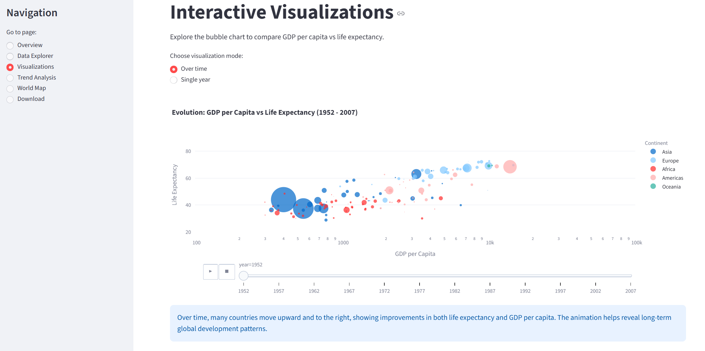

# 🌍 Gapminder Data Visualization Dashboard

An interactive web application built with [Streamlit](https://streamlit.io/) to explore global economic and demographic trends using the renowned **Gapminder** dataset. 

> **Note:** This project was developed as an assignment for the **Data Visualization Lab** course at University of Trento.

## 📖 Dashboard
The goal of this dashboard is to provide a user-friendly interface to explore the Gapminder dataset. It allows users to visually analyze the relationship between GDP per capita, life expectancy, and population across different countries and continents spanning several decades (1952 - 2007).

*Example of a dashboard page:*

()

## ✨ Features
The application is structured into five main sections accessible via the sidebar:
- **Overview:** Introduces the dataset and displays high-level KPIs and metrics.
- **Data Explorer:** Allows users to filter the raw dataset by continent, country, and year range.
- **Visualizations:** Features an interactive bubble chart displaying GDP per capita vs. Life Expectancy, with support for both static yearly views and animated timelines.
- **Trend Analysis:** Line charts enabling direct comparison of specific metrics (e.g., life expectancy, population) between multiple selected countries over time.
- **World Map:** An interactive choropleth map to explore the geographic distribution of life expectancy, GDP per capita, and population across the globe for specific years.
- **Download:** A utility page to apply custom filters and export the resulting data as a `.csv` file.

## 🛠️ Technologies Used
- **Python 3.11**
- **Streamlit:** For the web framework and interactive UI.
- **Plotly Express:** For creating complex, interactive data visualizations.
- **Pandas:** For data manipulation and filtering.
- **Docker:** For containerization and easy deployment.

## 🚀 Local Installation

To run this project locally on your machine, follow these steps:

1. **Clone the repository:**
```bash
   git clone https://github.com/chiamed/gapminder-streamlit-dashboard.git
   cd gapminder-streamlit-dashboard
```

2. **Create a virtual environment (optional but recommended):**
```bash
   python -m venv venv
   venv\Scripts\activate  # On Mac / Linux use: source venv/bin/activate
```

3. **Install the required dependencies:**
```bash
   pip install -r requirements.txt
```

4. **Run the Streamlit app:**
```bash
   streamlit run app.py
```

## 🐳 Docker Installation
If you prefer to run the application using Docker without installing Python dependencies on your local machine, follow these steps:

1. **Build the Docker image:**
```bash
   docker build -t gapminder-dashboard .
```

2. **Run the Docker container:**
```bash
   docker run -p 8501:8501 gapminder-dashboard
```
The application will be available at http://localhost:8501.

## 👨‍💻 Author
Medei Chiara
- Course: Data Visualization Lab
- Academic Year: 2025/2026
- GitHub: @chiamed